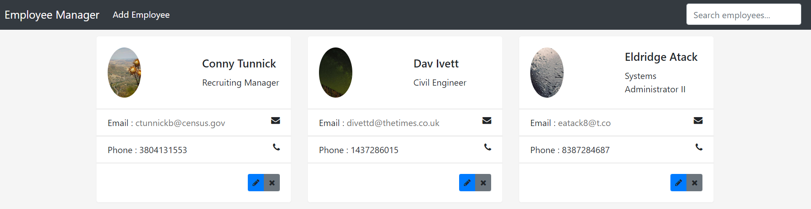
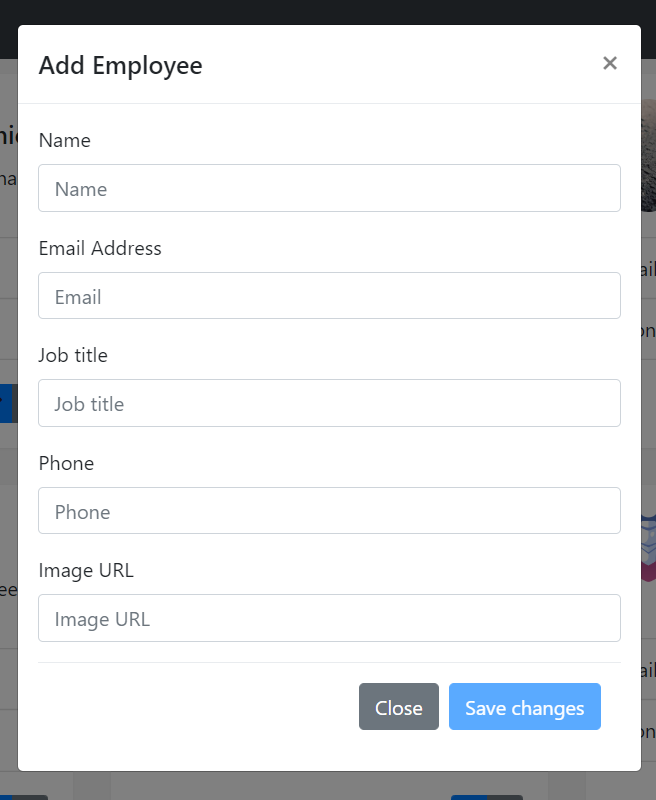
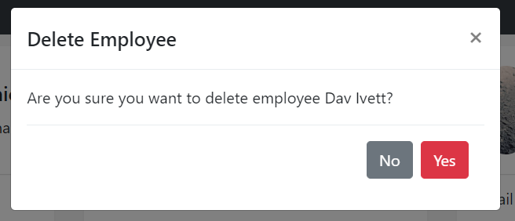

# Backend & Frontend projects :

## Tools :

- Intellij IDEA for java
- VsCode for angular
- Java 17
- Angular 14
- Spring boot 2.7
- Maven
- Terminal
- MySQL 8.x
- Cors configuration
- HeidSQL (Mysql console GUI)
- Fake data :
    - https://www.mockaroo.com/
    - https://lorem.space/
    - https://picsum.photos/

## Demo :

## Based on the tutorial from Amigoscode :

Spring Boot Full Stack with Angular | Full Course 2021 (https://www.youtube.com/watch?v=Gx4iBLKLVHk&t=5209s)